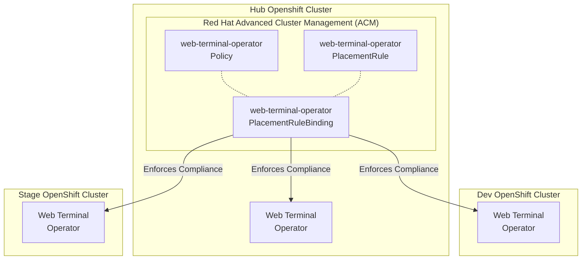
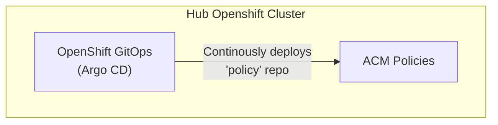

**NOTE: This repo is part of [Hello OpenShift: Multi-Cluster GitOps].** It's
not intended to be referenced directly. Instead, check out the organization's
page for how this repository fits into the greater multi-cluster GitOps
architecture.

# Governance Policy for ACM

This repo contains [Red Hat Advanced Cluster Management (ACM) for Kubernetes]
governance policies for all clusters. The goal of this repo is to show how ACM
policies can be deployed, instead of showcasing specific policies. Check out
[policy-collection] for policies you can apply to your clusters.

## How ACM Policies Work

ACM policies are used to validate that managed clusters match their expected
configuration. Each policy can require that specific manifests exist or do not
exist across one or many clusters. Policies can be configured to *inform*
compliance back to ACM or *enforce* compliance, which will automatically
remediate the managed cluster.

**The ACM policy objects in this repo are only deployed to the Hub cluster.**
Policies target a specific cluster or all clusters through a PlacementRule and
PlacementRuleBinding that also exist on the Hub cluster. The Hub cluster does
backend API calls to the managed clusters matching the placement rule to
validate compliance and to remediate findings.

For example, the `web-terminal-operator` policy, looks like:

For more information on policies, check out the [Governance Policy
Documentation] from Red Hat.

## How ACM Policies are Deployed

This repository is continuously deployed through [gitops-hub] to the Hub
cluster. New policies added to this repo will be automatically deployed to ACM
through Argo CD.

## When to use Policy vs. GitOps

A good rule of thumb is to use ACM policy for cluster configuration and GitOps
(Argo CD) for applications.

Here's a few examples where **policy** should be used:

* Deploying an operator across all clusters
* Creating a namespace across all clusters
* Enabling etcd encrpytion across all clusters
* Setting a specific unique setting per cluster

Here's a few examples where **GitOps** should be used:

* Deploying Quay registry on the Hub cluster
* Deploying a REST API to all clusters

[Governance Policy Documentation]: https://access.redhat.com/documentation/en-us/red_hat_advanced_cluster_management_for_kubernetes/latest/html/governance
[Hello OpenShift: Multi-Cluster GitOps]: https://github.com/hello-openshift-multicluster-gitops
[Red Hat Advanced Cluster Management (ACM) for Kubernetes]: https://www.redhat.com/en/technologies/management/advanced-cluster-management
[gitops-hub]: https://github.com/hello-openshift-multicluster-gitops/gitops-hub
[policy-collection]: https://github.com/stolostron/policy-collection
